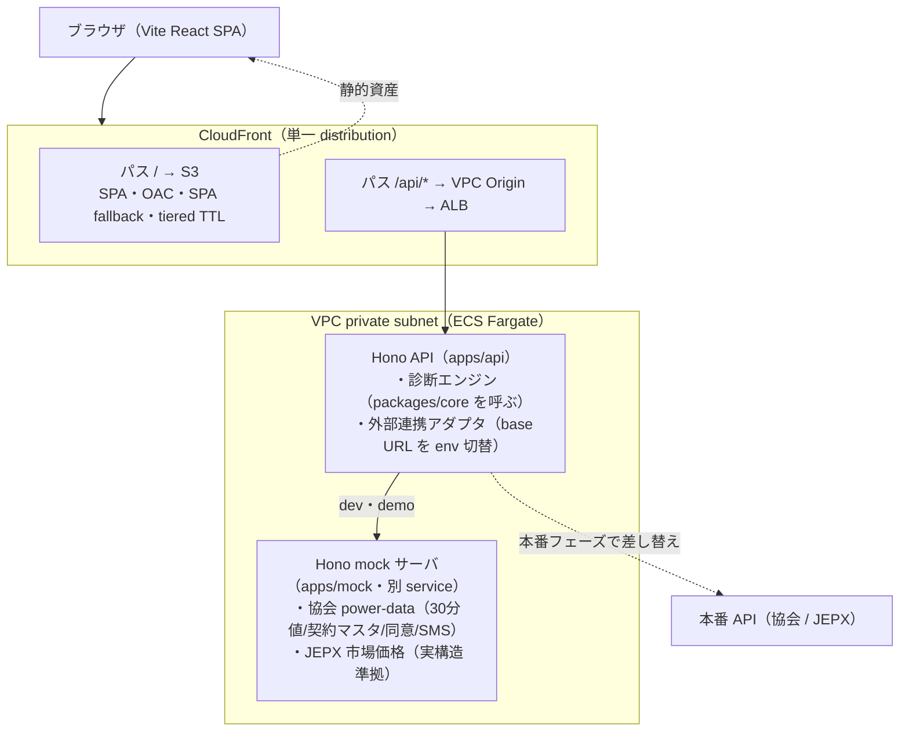

# 詳細設計: ワンタップ実データ診断 MVP

本書は [one-pager.md](../one-pager.md)（事業ブリーフ）を入力とした **MVP の詳細設計**。実装が着手できる技術仕様へ落とす。

本 MVP は **フルスタック構成**とする: frontend（SPA）+ backend（API）+ 外部連携を擬似する mock サーバを持ち、診断計算と外部連携は backend / mock 側に置く。最終的な deploy 先は **AWS（ECS）**。これにより、デモ画面がそのまま本番に地続きな構成（one-pager の「デモがそのまま事業提案の説得材料になる」）として成立する。

## 1. スコープ

one-pager の「MVP スコープ（開発1日）」を技術仕様化する。

| 区分 | 内容 |
|------|------|
| 作る | 診断エンジン（30分値 × 市場価格の料金計算 + 過去12ヶ月バックテストの月次グラフ）/ 同意フローのモック（電話番号 → SMS認証 → データ提供同意 → 取得中 → 診断結果 → 申込）/ プレフィル申込フォーム / **それらを支える backend API（Hono）** / **外部連携を擬似する mock サーバ（Hono）** |
| モック | SMS 認証・スマートメーター30分値の取得・契約マスタ取得・市場価格は **mock サーバ**が擬似する。backend は外部連携アダプタの向き先を env で mock/実API に切り替える |
| 範囲外 | 電力データ管理協会への加入・実 API 接続、実 SMS 送信、申込の永続化/送信、認証/認可基盤、本番 DB |

## 2. アーキテクチャ全体像



データの流れ: ブラウザ → CloudFront → backend API（診断計算）→ 外部連携アダプタ → mock サーバ（or 実 API）。frontend 自身は計算を持たず API を叩くだけ。

## 3. 技術スタック（2026-06 時点で最新安定版を WebSearch 検証）

| 層 | 採用 | 備考 |
|----|------|------|
| frontend | **Vite 8.1** + **React 19.2** + **TypeScript 6.0** + **Recharts 3.9** | Rolldown ベース / `@vitejs/plugin-react` v6。グラフは Recharts（SVG・宣言的、月次12点で十分） |
| backend / mock | **Hono 4.12.x** + **@hono/node-server**（Node 22 LTS） | TS 型推論が強く、`@hono/zod-validator` で検証済み型がハンドラへ流れる。Web Standards で multi-runtime |
| 型共有 | **Hono RPC**（`hc<AppType>`）+ **Zod** | backend の `AppType` を frontend が取り込み、API の型がフロントまで通る。契約は Zod |
| IaC | **AWS CDK (TypeScript)** | `ecs-patterns` で image build → ECR → Fargate → ALB を一括。monorepo と言語統一 |
| ランタイム基盤 | **ECS Fargate** + ALB + CloudFront + S3 + ECR | Lambda の制約（コールドスタート/15分/ペイロード上限/長時間接続）を避け、常駐コンテナで将来の拡張に耐える |
| コンテナ | multi-stage Dockerfile（build と runtime 分離、lean image） | Node 22 LTS ベース |

**バージョンの扱い**: 上表は設計時点（2026-06）の **baseline（採用する major/minor）**で、これを契約とする。実装着手時に行うのは「同 major 内の最新 patch/minor を確認して lockfile に exact 固定する」ことであり、**major を勝手に上げない**（上げる場合は本書を更新して差分を明示）。これでバージョンが「確定値」として安定する。

## 4. monorepo 構成

npm workspaces（本リポは npm 前提）でフロント/バック/mock/共有を1リポに収める。

```
apps/
  web/      # Vite React SPA（frontend）
  api/      # Hono backend（BFF + 診断エンジン呼び出し + 外部連携アダプタ）→ ECS
  mock/     # Hono mock サーバ（外部連携の擬似 + サンプルデータ生成）→ ECS(別service)
packages/
  core/     # 共有: ドメイン型 + 外部API契約(Zod) + 診断エンジン（純TS）
infra/      # AWS CDK（ECS Fargate + ALB + S3 + CloudFront + ECR + Secrets Manager）
```

`packages/core` を api / mock / web が参照する。RPC 型は api の `AppType` を web が取り込む。Hono RPC を monorepo で効かせるため、各 tsconfig は `"strict": true`。

## 5. ドメインモデル / データモデル（packages/core）

```ts
// 30分値（スマートメーターの計量値、1コマ = 30分）
interface ConsumptionReading {
  ts: string;        // ISO8601。コマ開始時刻（例 2025-07-01T13:30:00+09:00）
  kwh: number;       // そのコマの消費電力量 [kWh]
}

// 市場スポット価格（JEPX 相当、30分コマ単位）
interface MarketPrice {
  ts: string;        // ConsumptionReading.ts と1対1
  yenPerKwh: number; // そのコマの市場価格（エリアプライス）[円/kWh]
}

// 現行プラン（従量電灯B 相当）
interface CurrentPlan {
  name: string;
  basicYenPerMonth: number;  // 基本料金（契約アンペアで決まる固定額）[円/月]
  energyYenPerKwh: number;   // 従量単価（MVP は段階を畳んだ実効単価の固定値）[円/kWh]
}

// 市場連動プラン
interface MarketPlan {
  name: string;
  basicYenPerMonth: number;  // 基本料金 [円/月]
  marginYenPerKwh: number;   // 市場価格に上乗せするマージン [円/kWh]
}

// 契約マスタ（申込フォームのプレフィル用、制度経由で取得される想定）
interface ContractInfo {
  holderName: string;        // 契約名義
  contractAmpere: number;    // 契約電力 [A]
  supplyPointId: string;     // 供給地点特定番号（モック値）
  address: string;
}
```

**月境界・タイムゾーン**: すべて JST（+09:00）で扱う。月の帰属はコマ開始時刻の年月で決める。サンプルは**直近の完了月までの12ヶ月（2025-06 〜 2026-05）**で固定する（当日基準で動かさず再現性を保ちつつ、**未来日のコマを含めない** = 設計時点 2026-06-27 で進行中の 2026-06 を窓に入れると "過去実績" の主張が崩れるため、最終完了月 2026-05 までで切る）。窓を更新する場合も「最終完了月まで」の原則を守る。

外部 API の契約（リクエスト/レスポンス）は **Zod スキーマ**で `packages/core` に定義し、型とランタイム検証を同時に得る（§7 参照）。

**プランの取得元**: `CurrentPlan` / `MarketPlan` は外部 API からは取得しない（スマートメーターの 30分値や契約マスタには「現行の料金単価」が含まれないため）。MVP では両者を **`packages/core` の定数**として持つ:
- `CurrentPlan` = **想定する典型的な従量電灯B**（基本料金・実効従量単価を固定値で仮置き。本来はユーザー入力 or 現行明細から取るが MVP では代表値で割り切る）
- `MarketPlan` = **提供する市場連動商品**（基本料金・マージンは自社商品の定義値）

`POST /api/diagnose` は「mock から 30分値・市場価格・契約マスタを取得」＋「core のプラン定数」を入力に診断エンジンを実行する。`ContractInfo` は申込プレフィル用で、料金計算の入力には使わない（契約電力＝アンペアは将来の基本料金推定に使えるが MVP では `CurrentPlan.basicYenPerMonth` の固定値を採用）。

## 6. 診断エンジン仕様（packages/core、backend が呼ぶ）

純関数として実装し UI / サーバから独立させる（教材として計算式を明示。テスト可能）。**計算は backend 側で実行**し、結果のみ frontend に返す。

### コマ単位の料金（従量部分）
```
current_slot = kwh × currentPlan.energyYenPerKwh
market_slot  = kwh × (marketPrice.yenPerKwh + marketPlan.marginYenPerKwh)
```

### 月次集計（`MonthlyResult`）
各月 `m` について:
```
current_energy[m] = Σ current_slot   (その月のコマ)
market_energy[m]  = Σ market_slot
current_total[m]  = current_energy[m] + currentPlan.basicYenPerMonth
market_total[m]   = market_energy[m]  + marketPlan.basicYenPerMonth
diff[m]           = current_total[m] - market_total[m]   // 正 = 市場連動が安い
kwh[m]            = Σ kwh
isSpike[m]        = market_total[m] > current_total[m]  (= diff[m] < 0)
                    // その月は市場連動が「総額で」高い = §9 注記の「高騰月」。
                    // 従量だけでなく基本料金差も含めた総額で比較し、画面文言と一致させる
```

`isSpike` は「市場連動が**総額で**高くなる月」を指す（基本料金差を含む）。従量の実効単価だけで判定すると基本料金差を無視して画面の「市場連動が高くなる」表示とズレるため、`diff[m] < 0` を唯一の基準にする。

### 年間サマリー（`DiagnosisResult`）
```
annualCurrent = Σ current_total[m]
annualMarket  = Σ market_total[m]
annualDiff    = annualCurrent - annualMarket   // 正 = 年間で安くなる
annualDiffPct = annualDiff / annualCurrent
```

### 出力型
```ts
interface MonthlyResult {
  month: string;        // "2025-06"
  kwh: number;
  currentTotal: number;
  marketTotal: number;
  diff: number;
  isSpike: boolean;
}
interface DiagnosisResult {
  monthly: MonthlyResult[];   // 12要素、時系列昇順
  annualCurrent: number;
  annualMarket: number;
  annualDiff: number;
  annualDiffPct: number;
}
```

**バックテストの定義**: `monthly` をそのまま月次グラフに出す。高騰月（`isSpike`）も除外せず表示し、ツールチップ/色で示す。「平均では安いが高騰月は高い」という実態を隠さないことが one-pager の差別化の核。

## 7. 外部連携と mock サーバ（apps/mock）

### 公開仕様の調査結果
- **電力データ管理協会**（30分値・契約マスタ・同意・SMS）: 個データ利用は API 連携必須だが、**API 仕様は非公開**（会員＝審査制向けのみ）。→ 公開 OpenAPI が無いので **契約を自前で Zod 定義**する。
- **JEPX スポット価格**: **公開**（年次 CSV、受渡日 / 時刻コマ 1-48 = 30分 / システムプライス + 9エリアプライス、円/kWh）。→ mock の**外部契約は正規化済み JSON `MarketPrice[]`**（`{ts, yenPerKwh}`）とし、CSV は wire-format として扱わない（実 API では adapter が CSV をパースして同じ正規化型に変換し、mock はその変換後を直接返す）。「実 CSV 構造準拠」とは**値の意味論**（48コマ/日・対象エリアのエリアプライス・円/kWh）を実構造に合わせる、という意味。
- **SMS 認証**: 汎用・仕様非公開 → 簡易 mock。

### mock サーバの責務（Hono、`packages/core` の Zod 契約に準拠）
| エンドポイント（例） | 擬似する外部 | 振る舞い |
|---------------------|-------------|----------|
| `POST /sms/send` | SMS 送信 | 受付のみ返す（実送信なし） |
| `POST /sms/verify` | SMS 認証 | 固定コード（例 `123456`）で通す |
| `POST /power-data/consent` | 協会 同意 | 同意 ID を返す |
| `GET /power-data/readings` | 協会 30分値 | 12ヶ月分の `ConsumptionReading[]` を**決定的生成**して返す |
| `GET /power-data/contract` | 協会 契約マスタ | `ContractInfo` を返す |
| `GET /market/spot` | JEPX 市場価格 | 12ヶ月分の **正規化済み JSON `MarketPrice[]`**（`{ts, yenPerKwh}`）を返す。値の意味論は JEPX 実構造（48コマ/日・エリアプライス・円/kWh）に準拠して生成する |

backend（apps/api）は**外部連携アダプタ**を介してこれらを叩く。アダプタの base URL は env（例 `EXTERNAL_BASE_URL`）で切替: dev/demo → mock サーバ、本番 → 実 API。これにより mock/本番の差し替えがコード変更なしで効く（本番境界の seam）。

### サンプルデータ生成（mock サーバ内、決定的）
`Math.random()` は使わず seeded PRNG（mulberry32 相当）で、リロードしても同じ数字が出るようにする（デモ再現性）。
- **消費 30分値**: 日内カーブ（朝 7-9時・夕 18-22時ピーク）× 季節係数（夏 7-9月 / 冬 12-2月 高）× 平日/休日係数 × 小ノイズ。契約40A の単身〜2人世帯（年間 ~3,500-4,500 kWh）。
- **市場価格**: ベース（~10-15円/kWh）+ 日内変動（夕方ピーク）+ **高騰月**（冬 1-2ヶ月で一部コマが 40-80円/kWh）。one-pager の「高騰月も隠さず提示」を成立させる。JEPX の 48コマ/日・エリアプライス・円/kWh の構造に合わせる。

## 8. backend API 設計（apps/api、Hono）

`@hono/zod-validator` で入力検証、`AppType` を export して frontend に Hono RPC（`hc<AppType>`）で型共有。

| メソッド/パス（例） | 役割 |
|--------------------|------|
| `POST /api/auth/sms` | 電話番号受付 → mock の `/sms/send` |
| `POST /api/auth/verify` | コード検証 → mock の `/sms/verify`。**ステートレス署名トークン**（JWT 風、電話番号ハッシュ + 後続で得る consentId を claim に持つ）を発行 |
| `POST /api/consent` | データ提供同意 → mock の `/power-data/consent` |
| `POST /api/diagnose` | 30分値・市場価格・契約を mock から取得 → **packages/core の診断エンジンで計算** → `DiagnosisResult` を返す |
| `GET /api/contract` | プレフィル用 `ContractInfo` |
| `POST /api/application` | 申込受付（永続化なし、受領レスポンスのみ） |

CORS / セキュリティヘッダは Hono middleware。secret（トークン署名鍵・mock 切替 URL 等）は ECS task に Secrets Manager から注入。

**認証状態はステートレス**: SMS 検証後に発行する署名トークンを以降の API（`/api/consent` → consentId を claim に追記して再発行 / `/api/diagnose` / `/api/contract` / `/api/application`）が **Bearer で受け取り検証**する。サーバ側セッションや DB を持たないため、**ECS の複数タスク auto-scaling でも状態共有が不要**（どのタスクに振られてもトークンだけで本人・同意に紐づく）。署名鍵は Secrets Manager の単一値を全タスク共有。

## 9. 画面フロー / 状態遷移（apps/web）

単一ページ内の step state machine（`useReducer`）。各 step は backend API を叩く（frontend は計算を持たない）。

```mermaid
stateDiagram-v2
    direction LR
    PhoneInput: phone-input（電話番号入力）
    SmsVerify: sms-verify（SMS 認証）
    Consent: consent（データ提供同意）
    Fetching: fetching（取得 + 診断）
    Result: result（診断結果）
    Application: application（申込フォーム）
    Done: done（申込完了・終端）

    [*] --> PhoneInput
    PhoneInput --> SmsVerify: 送信
    SmsVerify --> Consent: コード一致
    SmsVerify --> PhoneInput: エラーで戻る
    Consent --> Fetching: 同意
    Fetching --> Result: 取得完了
    Result --> Application: 申込へ
    Application --> Done: 申込送信
    Done --> [*]
```



`done` は明示的な終端 state（reducer の最後の step）。「申込フォームで送信 → どこにも遷移できず黙ってフォームに留まる」を避けるため、完了画面を独立 step として持つ。

| step | 役割 | 叩く API / モック挙動 |
|------|------|----------------------|
| `phone-input` | 電話番号入力（本人確認の入口） | 形式バリデーション → `POST /api/auth/sms` |
| `sms-verify` | SMS 認証コード入力 | `POST /api/auth/verify`（固定コードで通す） |
| `consent` | データ提供同意 | 提供先 / 利用目的 / 提供期間 を明示 → `POST /api/consent` |
| `fetching` | 30分値・契約情報の取得中 | `POST /api/diagnose`（取得 + 計算）。スピナー表示 |
| `result` | 診断結果 | `DiagnosisResult` を表示。年間料金差 + 月次バックテストグラフ（Recharts）+ 高騰月注記 |
| `application` | 申込フォーム | `GET /api/contract` でプレフィル。送信で `POST /api/application` → `done` |
| `done` | 申込完了画面 | 「お申し込みを受け付けました」等。終端 state（戻り先なし） |

**同意画面の表示項目**: 提供先事業者名 / 利用目的（プラン診断と切替の提案）/ 取得データ種別（30分値・契約マスタ）/ 提供期間。

**結果画面の構成**:
1. ヒーロー: 「年間 約 ¥X 安くなる見込み」（`annualDiff` の符号で文言切替）+ 実効削減率
2. 月次バックテスト: 現行 vs 市場連動 の月次料金を並べた棒グラフ（Recharts `BarChart`）。高騰月をハイライト
3. 注記: 「高騰月（◯月・◯月）は市場連動が高くなります」を `isSpike` から動的生成
4. CTA: 申込へ

## 10. AWS 構成 / デプロイ（infra、CDK）

- **frontend**: S3（private bucket + OAC）+ CloudFront。`404 → index.html` の SPA fallback、index.html は短 TTL・ハッシュ付き資産は長 TTL（tiered TTL）。
- **backend / mock**: multi-stage Dockerfile → ECR → **ECS Fargate（private subnet）**。**ALB** 経由でルーティングし、**CloudFront VPC Origins** で ALB を非公開のまま配下に置く（public ALB 不要）。
- **CloudFront 1 distribution**: `/` → S3、`/api/*` → VPC Origin → ALB → ECS（Hono API）。
- **セキュリティ**: ECS task SG は ALB SG からのみ許可。secret は Secrets Manager 参照。
- **スケール**: CPU / メモリ / ALB リクエスト数で auto-scaling。
- **CDK**: `ecs-patterns.ApplicationLoadBalancedFargateService` で image build → ECR push → Fargate + ALB を一括構築。ただし VPC Origins 前提なので **`publicLoadBalancer: false`（internal ALB）**を明示し、ALB を public に晒さない（L2 パターンの既定は public ALB のため、ここを明示しないとセキュリティ前提と実装がズレる）。CloudFront の VPC Origin から internal ALB へ繋ぐ。mock は別 ECS service（内部）。

## 11. ローカル開発

- `apps/api` + `apps/mock` を **docker-compose** で併走（api は `EXTERNAL_BASE_URL=http://mock:PORT` を向く）。
- `apps/web` は Vite dev server（`/api` を api コンテナへ proxy）。
- Node 22 LTS。`@hono/node-server` でコンテナと同一コードがローカルでも動く。

## 12. モック範囲と本番境界

| 項目 | MVP（mock サーバ） | 本番フェーズ |
|------|--------------------|-------------|
| SMS 認証 | 固定コードで通す | 協会 STEP4 の SMS 認証 |
| 30分値取得 | mock が決定的生成 | 協会 API（30分値・過去最長3年） |
| 契約マスタ | mock が返す定数 | 協会 API（契約電力・名義等） |
| 市場価格 | mock（JEPX 構造準拠の生成） | JEPX スポット実績 |
| 申込 | 受領レスポンスのみ | 申込基盤への連携 |

backend のアダプタ向き先を env で切り替えるだけで mock ↔ 実 API を差し替えられる。

## 13. 制約・非対象（one-pager のリスクを技術制約へ）

- スイッチング以前のデータは取得不可 → MVP では「12ヶ月そろっている」前提の固定窓（§5）で割り切る。期間欠損の UI は範囲外。
- 旧型計器・定額電灯はデータ提供対象外 → フォールバック（スクショ/CSV アップロード簡易診断）は MVP 範囲外。
- 認証/認可は簡易（SMS 検証後の**ステートレス署名トークン**。サーバセッション/DB なしで auto-scaling と両立。§8 参照）。本格的な認証基盤・トークン失効管理・永続化・本番 DB は範囲外。
- 協会の事前登録・審査制は事業/制度の論点で、MVP（mock）の技術設計には影響しない。
